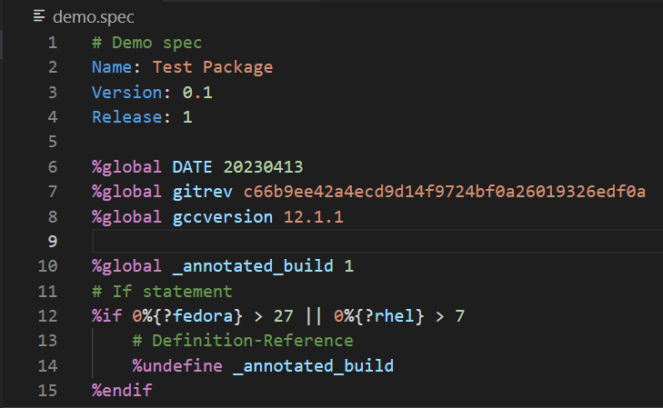
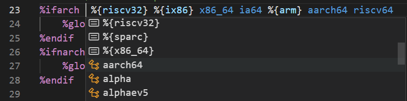
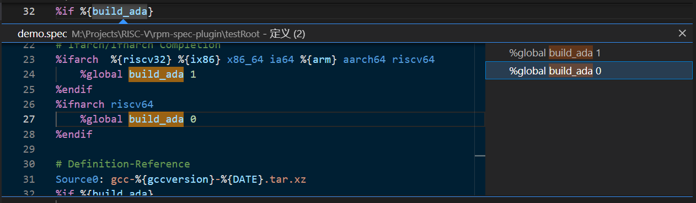
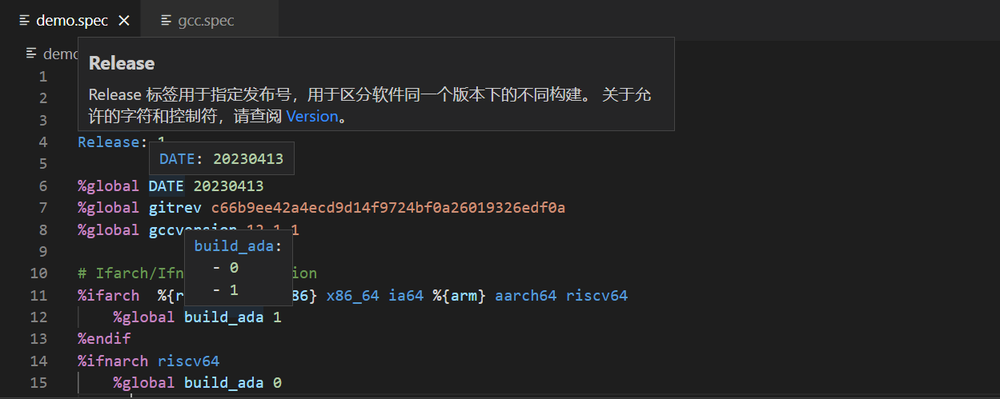

# RPM Spec Language Support

[Official](https://gitee.com/rvsmart-porting/rpm-spec-extension) | [中文版本](README.zh-cn.md)

This extension provides language support for RPM Spec files, implementing various auxiliary functions for developers.

This extension is developed and maintained by the [RVSmartPorting](https://gitee.com/rvsmart-porting) community,
and follows the [Mulan Permissive Software License，Version 2](http://license.coscl.org.cn/MulanPSL2).

## Main Features

+ Syntax Highlighting: RPM Spec file syntax highlighting

+ Code Completion Prompt: Prompt valid values when using `%ifarch` and `%ifnarch` macros

+ Definition/Usage Tracking: Track the definition and usage of `%global` variables

+ Mouseover Prompt: Keyword and constant value mouseover prompt

## TODO Features

+ Basic Syntax Checking: Check if the syntax of the spec file meets the specifications
+ Dependency Version Checking: Check if the dependencies corresponding to fields
  such as `Requires` and `BuildRequires` exist in the specified operating system distribution repository
+ Prompt for more built-in macros and keywords
+ Highlight embedded shell scripts.
