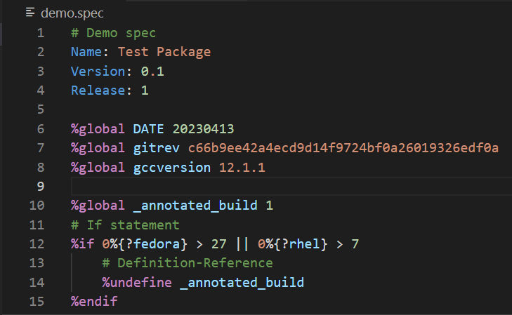
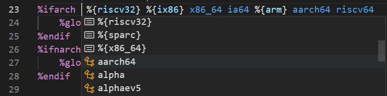

# RPM Spec 语言支持

[官网](https://gitee.com/rvsmart-porting/rpm-spec-extension) | [English](README.md)

本扩展对 RPM Spec 文件提供语言支持，实现了多种为开发者服务的辅助功能。

本扩展由 [RVSmartPorting](https://gitee.com/rvsmart-porting) 社区负责开发维护，
遵循 [木兰宽松许可证 (第2版)](http://license.coscl.org.cn/MulanPSL2)。

## 扩展主要功能

+ 语法高亮：RPM Spec 文件语法高亮

+ 代码补全提示：使用 `%ifarch` 和 `%ifnarch` 宏时提示有效取值

+ 定义/使用追踪：追踪 `%global` 变量的定义和使用

+ 鼠标悬浮提示：关键字和常量值悬浮提示

## 未来计划实现的功能

+ 基本语法检查：检查 spec 文件的语法是否满足规范
+ 依赖版本检查：检查 `Requires` 和 `BuildRequires` 等字段对应的依赖是否在指定的发行版仓库中存在
+ 更多内置宏、关键字的提示
+ 内嵌 Shell 脚本的高亮显示
